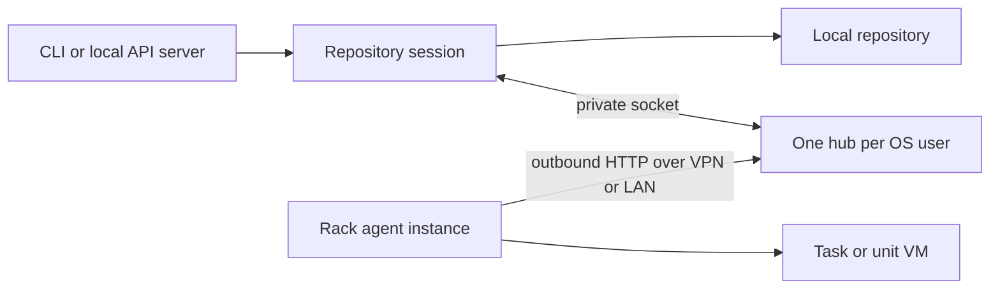

# Local rack delegation

Design of record for [#863](https://github.com/elaraai/east-workspace/issues/863).
The [reconciliation](e3-rack-reconciliation.md) links all ten children and
records how current workspace and e3-cloud main change the original design.
The [setup guide](../packages/e3-rack/README.md) contains runnable commands.

## Goals and non-goals

Delegate expensive stock-runtime task bodies from a local repository, preserve
ordinary e3 cache/results/history, and share one rack fleet across local
projects. Keep planning, repository ownership and local fallback on the
developer machine. Defer custom environments, remote function calls, automatic
reattachment after hub restart, built-in TLS and embedded UI integration.

## Topology

The rack initiates every request. The developer machine must remain reachable
for lease polling, object transfer, logs and completion. No cloud account or
cloud control plane participates in a local lease. Agent instances on a rack
have separate identities and services but share physical resources.

## Package layout

`@elaraai/e3-rack` owns protocol, identity, registry, leases, routes, hub,
client, routing and runner adapters. Its root exports the public local APIs;
`./protocol` exports shared wire types; `./testing` exports the real-runner
test agent and contract suites; `./hub-main` starts the hub process. Core only
knows the optional task-body hook; it has no dependency on rack code.

The API server consumes an injected dataflow runner factory. `--rack` loads
the optional package at runtime. Its optional peer creates a pnpm scheduling
cycle, although the server has no build-time rack import: build scripts first
compile the server's dependencies excluding rack, then build the full graph.

## Wire protocol

Typed control and rack requests use BEAST2 and normal response envelopes.
Streamed object bodies are raw bytes. Existing `eventJson` and `resultJson`
remain JSON strings for compatibility with the pinned cloud agent; replacing
them requires a negotiated protocol change, not silently changing the decoder.
The event is the current v2 task/unit envelope, including the unit's `merge`
and `own`, input closure, e3 version, launch identity and timeout.

Output declaration names hash and length; the response is `held` or a PUT
target with headers. A successful PUT returns an opaque receipt in
`x-amz-version-id`, as the current agent uploader requires. Commit validates
receipt, declaration, hash and length while the lease is held. Success verifies
and re-references the complete output graph before writing a terminal record.

## Hub

The hub owns a private home, control socket/Windows pipe, ownership lock,
configuration, fleet and in-memory queue. Lock publication and stale-owner
recovery elect one process, including simultaneous startup. Default binding is
off; the operator configures a reachable private listener. Idle exit can be
disabled with zero minutes.

Control routes cover handshake, sessions, lease subscription/cancellation,
ordered events, capacity/status, config, enrollment, removal, boot approval,
drain and stop. Sessions register canonical repository paths, their exact e3
release, process identity and private data endpoints. The hub derives opaque
repository aliases but never opens a repository or interprets its objects.

Dispatch fairly interleaves session owners. Identical task/input work in the
same canonical repository and release shares one lease. A late subscriber
receives its current claim. A live compatible session takes over repository
operations when an owner departs. Per-lease fences cover attempt transitions,
commits, cancellation and logs; registration fences cover heartbeat/removal
and boot approval. v2 completion lacks an attempt identity, so a prior
claimant cannot reclaim the same lease and ambiguously complete a new attempt.

The storage bridge proxies streams through a live session. Capabilities are
bound to the repository alias, lease and attempt, restricted to the admitted
closure or declared outputs, expire, and are revoked on lease termination or
reclaim. Uploads use distinct temporary files per PUT: an old request's cleanup
cannot remove a successor's acknowledged upload. Acknowledged metadata survives
session takeover; lease cleanup removes staging without removing committed
objects. Staging GC collects orphaned files after crashes.

## Client

`connectHub` probes a fixed handshake, starts a detached process when absent,
and requires the supported control protocol exactly. Older hubs are asked to
drain; newer protocols are refused. `RackSession` owns registration, the data
socket, event polling, capacity snapshots, subscriptions and log tees. Requests
have finite deadlines and abort on close/loss. A lost hub causes local fallback,
not silent reattachment to a new process mid-run.

## Routing

Policy is repository state at `rack/policy.beast2`. CLI overrides select whether
to attach; enabled is false by default. First matching whole-name glob wins.
Unmatched tasks stay local in opt-in mode; auto mode selects eligible tasks.

Eligibility checks task name/selection, environment, stock runtime/platform
configuration, East body and every executable program (including dict merge
and fold combine). It does not depend on a map unit running first. Custom
commands/environments/platforms and unscannable bodies remain local. The host
guard rejects file, environment and network dependencies unless deliberately
overridden per rule. Images are node, py, py-datascience, c and full; claims
also enforce health, approval and the lease's bundled-e3 version floor.

## Execution semantics

Core probes the cache before the body hook. The hook takes no local budget
grant; its local continuation preserves all existing process settings and
budget. The orchestrator's width includes compatible remote slots. Split-task
planning and final assembly stay local; both pieces and merge bodies delegate.

| Outcome | Record and action |
| --- | --- |
| Cache hit | Return the cached result; no lease. |
| Ineligible or no compatible rack | Use the ordinary local body. |
| Capacity full | Spill when enabled and local cores/memory are available; otherwise wait. Dedupe attachment precedes spill. |
| Claim | Mint a new attempt; write hub owner before running, then persisted placement log and claim event. |
| Success | Verify whole output, flush logs, record success, publish completion. |
| Task failure (including signal exit) | Record failed and return the verdict; retry locally only if explicitly configured. |
| Infrastructure failure or lost lease | End the rack attempt and run locally with a fresh execution identity. |
| Timeout | Record an error; no local retry. The host also enforces the deadline. |
| One subscriber cancels | Detach it and record its cancellation; preserve shared work. |
| Last subscriber cancels | Cancel lease, stop on the agent's next heartbeat, record cancelled; no local retry. |
| Hub dies | Local fallback; existing owner liveness rules identify the dead hub's attempt. |

Results retain the usual execution identity, unit flag, output, peak memory and
history shape. Placement never enters cache keys. API dataflow factories receive
the server's existing storage and shared budget, close their session after
success/failure/cancellation or failed start, and leave calls/mutations local.

## Versions and persisted forms

The cloud pin is `43d9ac9d9a423b69450320f6a802a8191ffefd53`; protocol golden
fixtures were generated from that checkout. Agents advertise `+e3.<release>`;
bundled e3 must meet the project's floor. Local control protocol is initially
1 exactly; no numeric greater-than compatibility assumption is made for
positional BEAST2 structs.

Task/package/repository object and execution schemas do not change. The new
policy is repository state, and future incompatible changes need a repository
upgrade. Hub files are outside repositories: a stable envelope stores release,
format (initially 1) and encoded payload. Unknown formats fail explicitly; a
future change must migrate or refuse them before decoding. Session upload
metadata and locks are transient host state, not portable package objects.

## Security

Private home/socket permissions isolate local controls by OS user. Enrollment
tokens are single-use and expire; machine credentials are hashed at rest,
rotate with overlap and are revoked by removing the registration. An optional
IP allowlist narrows the HTTP listener. A rack sees only its lease's input
closure and declared output targets, not arbitrary repository objects or local
paths. HTTP requires a trusted private network or an external TLS terminator.

## Testing

`TestRackAgent` speaks the real wire, stages the input closure, executes stock
e3-core runners and uploads every written object. Protocol fixtures validate
current-cloud encoding independently. Contract tests cover identity, stores,
leases, transfer receipts/retries, revocation, lost leases, takeover, cancellation
and cache/hash parity. CLI and local API tests exercise the complete attachment
path. Browser/API portability and absence of the optional peer have separate
tests. These are not evidence of KVM or deployed-rack acceptance.

## Relationship to e3-cloud and open items

The package exposes cloud-compatible shared seams without importing or changing
the closed repository. Cloud may adopt those seams in its own change. The
current agent protocol can serve the local hub; the explicitly printed
multi-instance flags avoid relying on cloud #192's unfinished default changes.
Cloud #193 still needs request deadlines and durable completion retries.
Cloud #195's real-agent/hardware acceptance remains distinct from the test agent.
See the reconciliation for the status of every companion and deferred feature.
